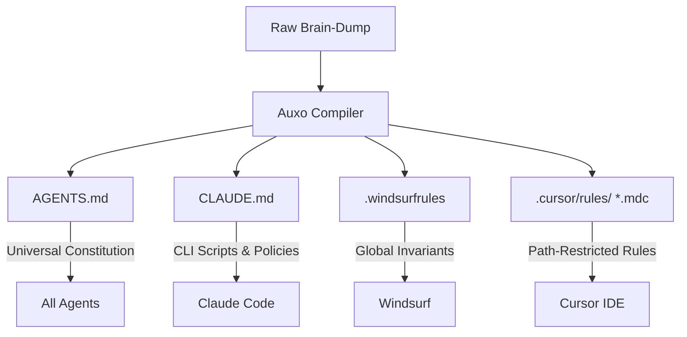

# Auxo - Precision AI Agent Prompt Context Compiler

[](LICENSE)
[](https://nextjs.org/)
[](https://tailwindcss.com/)
[](https://supabase.com/)

**Auxo** is a zero-auth, real-time collaborative prompt engineering workspace. It parses unstructured brainstorming notes and Greenfields requirements into a prompt-optimised context matrix (the **Compiled Agent Pack**) for 2026 AI coding assistants (such as Antigravity, Claude Code, Cursor, and Windsurf).

Live Environment: [https://auxo.wo0.dev/](https://auxo.wo0.dev/)

---

## 1. Why Context Compiling & Sharding?

Monolithic system prompts degrade AI coding assistant performance due to:

1. **Lost-in-the-Middle Effect:** Large Language Models (LLMs) suffer from attention decay when prompt windows exceed critical thresholds. Instructions located in the middle of a massive file are frequently ignored.
2. **Token Bleed:** Loading global guidelines (such as database rules) for minor visual edits (like editing a CSS file) wastes input tokens and raises API billing.

Auxo solves this by compiling raw specifications into a tiered context matrix:



---

## 2. What Auxo Produces

- **`AGENTS.md` (The Constitution):** Universal baseline containing high-level framework definitions, global constraints, coding philosophies (DRY, KISS, SOLID, YAGNI), and database exclusions.
- **`CLAUDE.md` (Claude Code Native):** Configured specifically for Anthropic's Claude Code CLI. Maps safe scripts and CLI policies, referencing `@AGENTS.md` to avoid duplicating context.
- **.windsurfrules:** Global project invariants and command boundaries for Windsurf's agentic loop.
- **`.cursor/rules/*.mdc` (Cursor Path-Restricted Rules):** Uses YAML frontmatter to bind rules directly to matching directories (e.g., frontend styling rules trigger on `src/components/**/*`, while queries are restricted to backend paths). This cuts token overhead by up to 18.4%.

---

## 3. Tech Stack

- **Core:** Next.js 16 (App Router, Server Components by default), React 19.
- **Styling:** CSS-Native Tailwind CSS v4.
- **Sync:** Supabase Realtime (low-latency transient broadcast & presence channels, zero database logs).
- **Billing:** Stripe Checkout integration.
- **Obfuscation:** Symmetric client-side XOR obfuscation for Bring Your Own Key (BYOK) parameters.
- **Compression:** JSZip for client-side prompt pack compilation.

---

## 4. Local Development Setup

To run Auxo locally, clone the repository and configure your variables.

### Prerequisites

- Node.js (v18+)
- npm

### Installation

1. Clone the repository:
   ```bash
   git clone https://github.com/auxo-labs/Auxo.git
   cd Auxo
   ```
2. Install dependencies:
   ```bash
   npm install
   ```
3. Run the development server:
   ```bash
   npm run dev
   ```
   Open [http://localhost:3000](http://localhost:3000) in your browser.

---

## 5. Environment Configuration

Create a `.env.local` file at the project root to map keys. (Note: None of these are required to boot local dev; if missing, Auxo automatically falls back to local offline mock compilations).

```env
# Supabase Configuration (Client Connection)
NEXT_PUBLIC_SUPABASE_URL=https://your-project.supabase.co
NEXT_PUBLIC_SUPABASE_ANON_KEY=eyJhbGciOiJIUzI1NiIsInR5cCI6IkpXVCJ9...

# Stripe Configuration (PAYG Credits & Developer Tiers)
STRIPE_SECRET_KEY=sk_test_...
NEXT_PUBLIC_STRIPE_PUBLISHABLE_KEY=pk_test_...
STRIPE_WEBHOOK_SECRET=whsec_...

# Hosted LLM APIs (For Cloud Compilation Fallbacks)
OPENAI_API_KEY=sk-proj-...
ANTHROPIC_API_KEY=sk-ant-api03-...
```

---

## 6. Directory Structure

```text
src/
├── app/
│   ├── api/
│   │   ├── checkout/route.ts       # POST: Stripe checkout session generation
│   │   ├── compile/route.ts        # POST: API rate limits, credit balance decrementor & compilation
│   │   └── challenge/route.ts      # GET: Cryptographic Proof-of-Work generators
│   ├── optimality/page.tsx         # Technical research report & efficiency analysis
│   ├── pricing/page.tsx            # Cloud tier and BYOK capability matrices
│   ├── room/[id]/                  # Workspace collaborative view
│   │   └── hooks/
│   │       ├── useRoomSync.ts      # Broadcast listeners & localStorage synchronization
│   │       └── useResizable.ts     # Split-pane drag controller hooks
│   └── page.tsx                    # Minimalist, Bento-grid landing interface
├── components/
│   ├── editor.tsx                  # Keystroke markdown canvas
│   ├── preview.tsx                 # VS Code-style workspace previewer
│   └── settings-modal.tsx          # BYOK key configuration modal (XOR client encryption)
└── lib/
    ├── prompt-compiler/            # Multi-pass LLM & parser compiler logic
    │   ├── clients.ts              # Gemini, OpenAI, Anthropic request clients
    │   ├── mock-compiler.ts        # Offline fallback compiler templates
    │   ├── system-prompt.ts        # Compiler system instructions
    │   └── parser.ts               # MDC marker parser and code cleansers
    ├── tech-resolver.ts            # Live registry dependency checker
    └── zip-exporter.ts             # JSZip client bundler utilities
```

---

## 7. Licence

Distributed under the PolyForm Non-Commercial License 1.0.0. See [`LICENSE`](LICENSE) for details.
