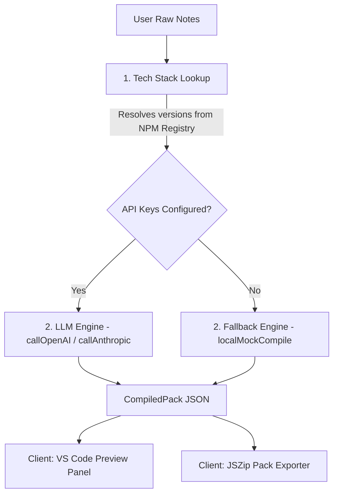

# Compiler Specs & Architecture Tradeoffs

This document outlines the current execution flow of the **Compiled Agent Pack (CAP)**, compares LLM vs. Local mock compiling strategies, and proposes concrete future scaling improvements.

---

## 1. How the Compiled Agent Pack (CAP) Works

The CAP pipeline runs entirely in client-side memory combined with a server-less API parser, maintaining a stateless data flow:

### Stage 1: Dependency Version Resolution
When a compile command is triggered, the raw markdown string is passed to [tech-resolver.ts](file:///Users/danwooster/1.%20DEV/auxo/src/lib/tech-resolver.ts):
1. **Detection:** Regex flags identify packages (`next`, `tailwindcss`, `prisma`, `@supabase/supabase-js`).
2. **NPM Registry Queries:** The server performs standard `fetch` operations to retrieve current version tags from `registry.npmjs.org`.
3. **Caching:** Query requests are cached for 1 hour using Next.js segment caching, protecting the NPM registry from rate-limiting.
4. **Invariant Mapping:** Invariants (e.g. Tailwind v4 CSS `@theme` files and Next.js 16 param Promise resolutions) are extracted and mapped to the package signature.

### Stage 2: Prompt Pack Generation
The resolved tech signatures feed into the compile logic:
* **The LLM Compilation Pathway:**
  If `OPENAI_API_KEY` or `ANTHROPIC_API_KEY` is present:
  - Generates a system prompt grounding the model in the NPM versions and invariants.
  - Passes the raw notes to `gpt-4o-mini` (or `claude-3-5-sonnet`) demanding a JSON payload conforming to the custom structure.
  - The model parses the chaotic specs into a structured global constitution (`AGENTS.md`), CLI commands (`CLAUDE.md`), roadmaps (`phases.md`), and glob-scoped rules (`.cursor/rules/*.mdc`).
* **The Local/Bypass Compilation Pathway:**
  If keys are absent, [prompt-compiler.ts](file:///Users/danwooster/1.%20DEV/auxo/src/lib/prompt-compiler.ts) evaluates `localMockCompile`:
  - It runs a title matching regex (`projectName = titleMatch ? titleMatch[1].trim() : 'Project Auxo'`).
  - It scans for category-specific keywords (e.g. `crypto`, `ledger`, `medical`, `farm`, `pipeline`) to serve pre-configured mock templates (like *SignalSignal*, *LedgerCore*, or *FieldSync*).
  - If no categories match, it falls back to the *AppCore* general default template.

### Stage 3: Client Render & Bundling
- The JSON response maps files to contents.
- The client-side preview component ([preview.tsx](file:///Users/danwooster/1.%20DEV/auxo/src/components/preview.tsx)) displays the files in an interactive folder tree with code gutters and click-to-copy helpers.
- The **Download Pack** action uses `JSZip` to compile the generated matrix into a ZIP package (`auxo-blueprint-[roomId].zip`) locally on the client.

---

## 2. LLM vs. Local Compiler Tradeoffs

| Architectural Dimension | Local Fallback Compiler (Deterministic) | LLM-Driven Compiler (Generative) |
| :--- | :--- | :--- |
| **Execution Latency** | $\approx 0\text{ms}$ (instantaneous page feedback). | $1.5\text{s} - 3\text{s}$ (network round-trip + inference). |
| **Financial Overhead** | Completely free. | Pay-per-token API cost (offset by Stripe gate). |
| **Scope Adaptability** | Limited to hardcoded regex categories. Custom projects fall back to generic "AppCore" stubs. | Adaptable. Parses any chaotic developer brainstorming document into specific, tailored files. |
| **Naming Uniformity** | Uses static glossary tables (e.g., `ticker`, `averagePrice` for crypto). | Synthesizes a custom domain dictionary dynamically based on developer specifications. |
| **Path Rules (MDC)** | Generic template structures (`ui-theme.mdc`, `logic-api.mdc`). | Writes customized MDC rules with path-restricted globs tailored to the architecture. |
| **API Dependencies** | Offline capable; zero external dependencies. | Requires connection to OpenAI/Anthropic APIs and configured server environment keys. |

---

## 3. Recommended Compiler Improvements & Scaling

To make the generated CAPs highly optimized for 2026 developer environments, the following upgrades are recommended:

### 1. Granular MDC Rules Partitioning
Instead of only generating `ui-theme.mdc` and `logic-api.mdc`, update the compiler templates/instructions to generate specialized rules targeting:
* **Database Modeling rules (`db-schema.mdc`):** Bound to `src/lib/db/**/*` or database schemas, detailing query constraints and connection pools.
* **State Stores (`state-management.mdc`):** Bound to state managers (Zustand, Redux), preventing concurrent mutations and state sync errors.
* **API Invariants (`api-handlers.mdc`):** Bound to route handlers to enforce strict JSON schemas and error codes.

### 2. Deep Grounding of Code Blueprints
Update the system prompt (and local mock templates) to inject the *exact* resolved NPM package versions directly into the `.mdc` code blocks. For example, if Tailwind v4 is resolved, the UI rules should contain code templates demonstrating the `@theme` directive inside the CSS variables block instead of legacy tailwind configs.

### 3. Visual Token Budgets & Glob Scope Maps
To reduce LLM context token bleed, instruct the compiler to output a visual **Glob Scope Hierarchy Map** in `AGENTS.md` (or the README), indicating exactly which files load which `.mdc` rules. This guides developer agents on how to scoped-load context files.
