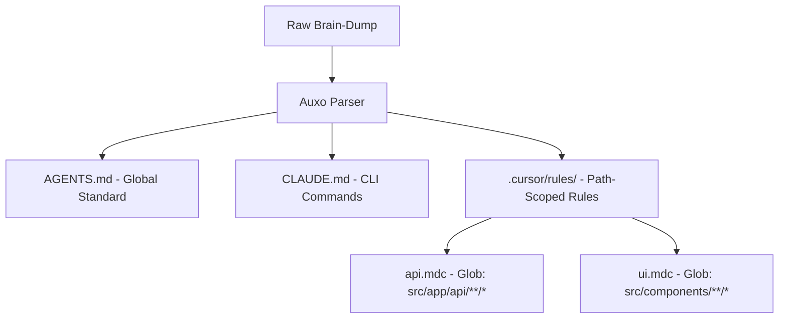

# Prompt Architecture: Parsing Greenfield Notes into 2026 AI Agent Context

This research outlines the optimal specifications and architectural guidelines for generating AI developer context files (`AGENTS.md`, `CLAUDE.md`, and `.cursor/rules/`). Designing this mapping accurately is the **core technical moat** for Auxo. It ensures 2026 AI coding assistants (such as Claude Code, Cursor, Aider, and OpenClaw) operate with maximum accuracy, zero attention degradation, and optimal token efficiency.

---

## 1. The Core Problem: "Lost-in-the-Middle" & Token Bloat
When developer notes are naively dumped into a single context file (such as a massive `.cursorrules` file), AI performance degrades due to two primary factors:
1. **Context Fragmentation & Lost-in-the-Middle:** LLM models suffer from attention degradation when context windows exceed optimal thresholds. Rules located in the middle of a large prompt block are frequently ignored or overridden.
2. **Token Bleed:** Loading global rules for simple edits (e.g., reading a database schema rule when editing a CSS file) wastes input tokens, raising developer API billing and slowing down execution.

### The Solution: Scoped Context Segmentation
Auxo resolves this by splitting unstructured text into a tiered hierarchy of global files and path-specific rules:



---

## 2. AGENTS.md (The Cross-Agent Standard)
`AGENTS.md` is the universal, open baseline read by over 30 coding assistants. It serves as the project's **structural source of truth** without relying on proprietary platform schemas.

### Key Content Rules for AGENTS.md:
*   **Imperative Coding Directives:** Use command-first, active statements (e.g., *"Adhere to SOLID design"* instead of *"This project should use SOLID principles"*).
*   **Directory Mapping Table:** A high-level description of what directories exist and what types of files they host.
*   **Build & Test Boundaries:** Explicit commands to build, start, and verify the codebase. This stops agents from running exploratory terminal command queries.
*   **Architectural Exclusions:** A dedicated section specifying code patterns or dependencies that must **never** be used.

### High-Fidelity AGENTS.md Template:
```markdown
# AGENTS.md

## System Overview
- **Project Name:** [Name]
- **Language:** TypeScript
- **Framework:** Next.js 16 (App Router)

## Directory Mappings
| Directory | Target Content | Conventions |
| :--- | :--- | :--- |
| `src/app` | Route handlers & Page components | Folder-based app routing, keep pages thin |
| `src/components` | Reusable React components | Functional, tailwind-styled, client/server declared |
| `src/lib` | Core business logic & utility modules | Pure functions, stateless helpers, mock fallback paths |

## Build & Verification Commands
- **Install Dependencies:** `npm install`
- **Development Server:** `npm run dev`
- **Build Production:** `npm run build`
- **Verification Tests:** `npm test`

## Strict Constraints & Exclusions
- Do NOT use third-party auth services (e.g. Clerk, Auth0).
- Do NOT utilize stateful databases for user session storage.
- Never write database configuration files directly to client-side page code.
```

---

## 3. CLAUDE.md (Claude Code Native)
`CLAUDE.md` is configured specifically for Anthropic's Claude Code CLI tool. Since Claude Code loads this file at the start of every session, its size must be minimized to preserve input token limits.

### Key Content Rules for CLAUDE.md:
*   **Direct Reference Symbol:** Reference global rules using `@AGENTS.md` instead of duplicating contents.
*   **Command Boundaries:** Define which CLI actions are safe to run (e.g., starting dev environment, tests, builds) and which need prompt confirmations.
*   **Code Style Anchors:** Bullet points declaring syntax styles (e.g., imports, error handling patterns).

### High-Fidelity CLAUDE.md Template:
```markdown
# CLAUDE.md

## Context Rules
- Refer to @AGENTS.md for global directory structures and structural constraints.

## Build and Test Commands
- **Dev:** `npm run dev`
- **Test:** `npm test`
- **Build:** `npm run build`
- **Lint:** `npm run lint`

## CLI Operational Policies
- Running code generation scripts requires explicit user approval.
- Modifying environment files (`.env`) is strictly prohibited.

## Core Code Conventions
- Use async/await for asynchronous fetching.
- Always handle API failures gracefully returning error boundaries.
```

---

## 4. .cursor/rules/ (Cursor MDC Directory)
Cursor rules are the most powerful context files because they utilize **YAML frontmatter** to bind rules dynamically to filepaths (`globs`).

### Key Content Rules for .mdc files:
*   **Globs Scoping:** Force Cursor to only load the rule when working inside matching paths (e.g., `src/app/api/**/*`). This saves up to 16.6% in token overhead.
*   **YAML Metadata block:** Populated with `description`, `globs`, and `alwaysApply: false`.
*   **Code Templates:** Provide concrete snippets of the code structure expected in that directory.

### High-Fidelity .mdc Template (e.g., `src/components/ui.mdc`):
```markdown
---
description: Code guidelines for all reusable React components and styling structures
globs: src/components/**/*, src/app/**/*.tsx
alwaysApply: false
---
# React UI Styling Rules

## Architecture Constraints
- Ensure components are marked `'use client';` if they utilize React hooks.
- Put styling design tokens in CSS files instead of hardcoding arbitrary utility strings.

## Code Blueprint Shape
When creating a React UI component, apply this exact layout standard:
```typescript
'use client';

import * as React from 'react';

interface ComponentProps {
  label: string;
}

export function CustomButton({ label }: ComponentProps) {
  return (
    <button className="h-9 px-4 rounded border border-white/5 bg-white/[0.02] text-xs font-mono font-medium hover:border-white/10 transition-colors">
      {label}
    </button>
  );
}
\```
```

---

## 5. The Conversion Blueprint (Auxo Engine Rule)
When Auxo converts chaotic founder notes into the agent stack, the LLM orchestration pipeline must apply the following **Parser Pipeline Matrix**:

| Source Note Pattern | Target File | Structural Transformation |
| :--- | :--- | :--- |
| Tech stack, tools, project description | `AGENTS.md` | Maps to `System Overview` and `Directory Mappings`. |
| Exclusions, constraints ("no auth", "wiped instantly") | `AGENTS.md` | Formats into `Strict Constraints & Exclusions`. |
| Script references, testing, deployment | `CLAUDE.md` | Compiles into `Build and Test Commands`. |
| Database architecture, APIs, routes | `api.mdc` | Scopes into `.cursor/rules/api.mdc` with `globs: "src/app/api/**/*"`. |
| UI pages, components, CSS patterns | `ui.mdc` | Scopes into `.cursor/rules/ui.mdc` with `globs: "src/components/**/*"`. |
