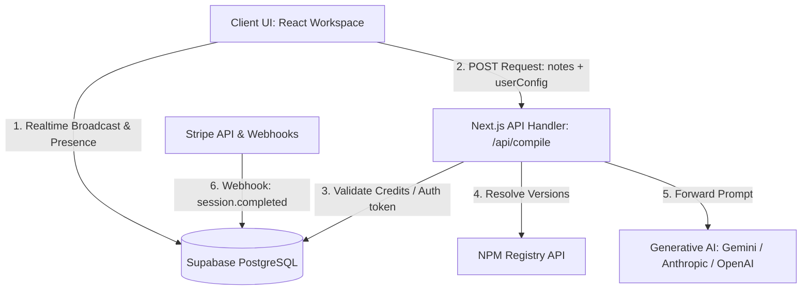
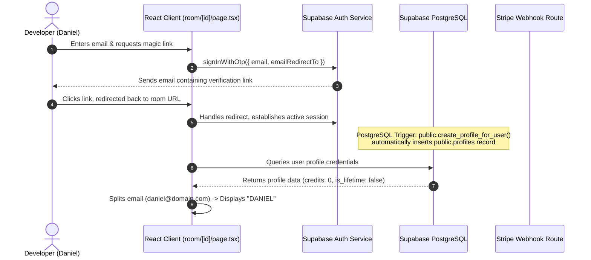
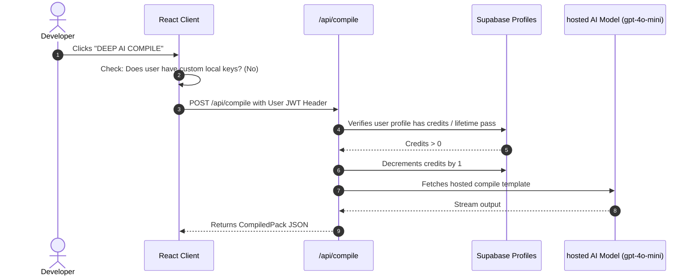
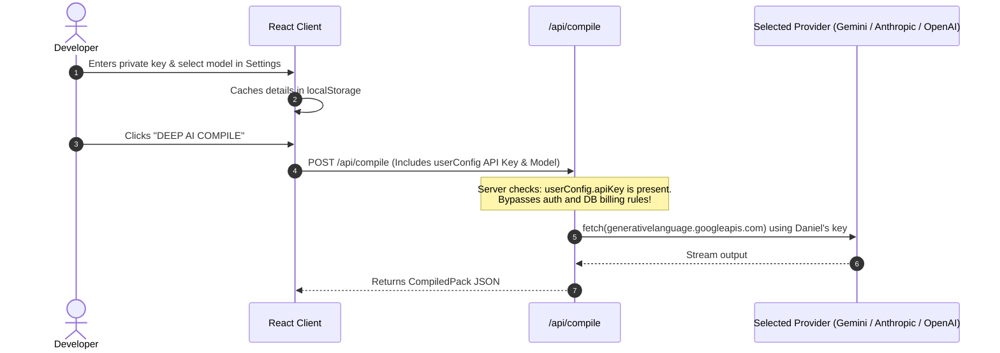

# Auxo System Architecture & Service Flow

This document details the architectural layout, authentication flows, Stripe payment handshakes, and Bring Your Own Key (BYOK) execution pipeline for Auxo.

---

## 1. Architectural Overview

Auxo operates on a stateless server API layer backed by ephemeral real-time messaging on the client, client-side configuration caches, and optional Supabase authentication + Stripe billing infrastructure.

---

## 2. Authentication & User Profile Synchronization

Auxo uses passwordless Magic Link logins powered by Supabase OTP auth. The public user profile holds credit balances and lifetime pass flags.

---

## 3. The Compile Pipeline & Gateways

Auxo supports three compilation triggers. The route handler at `/api/compile` filters requests based on user configuration and authentication status.

### A. Hosted Premium Compile (Authenticated + Gated)
If Stripe billing is enabled and no client-side custom keys are present, compiles consume credits.

### B. BYOK Bypass Compile (Free + Local Key)
If the user configures custom keys, the entire billing database layer is bypassed, routing directly to the developer's private AI endpoint via server proxies.

---

## 4. Key Directory & Code Mappings

To trace execution paths, reference the following codebase locations:
- **Client Workspace Page:** [room/page.tsx](../src/app/room/[id]/page.tsx)
- **Settings configuration:** [settings-modal.tsx](../src/components/settings-modal.tsx)
- **Supabase initialization:** [supabase.ts](../src/lib/supabase.ts)
- **Tech Stack Registry Resolver:** [tech-resolver.ts](../src/lib/tech-resolver.ts)
- **LLM Compiler logic:** [prompt-compiler/](../src/lib/prompt-compiler/) (modular folder)
- **Stripe Webhook handler:** [route.ts](../src/app/api/webhooks/stripe/route.ts) (Stripe webhooks)
